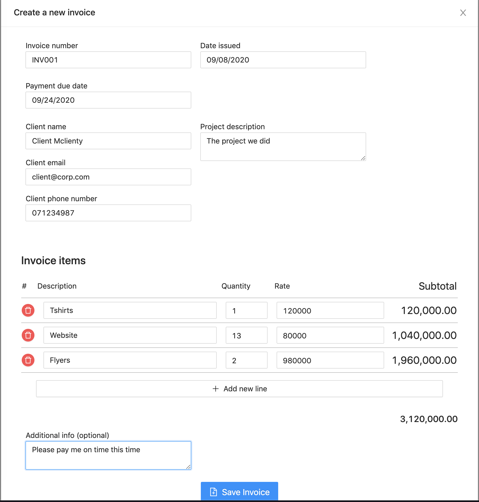
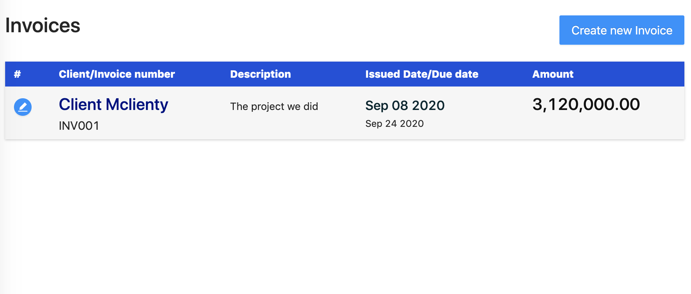
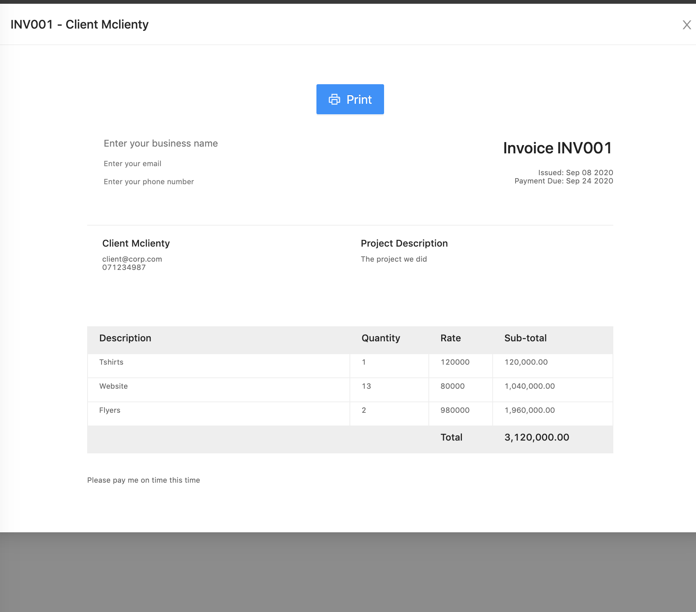
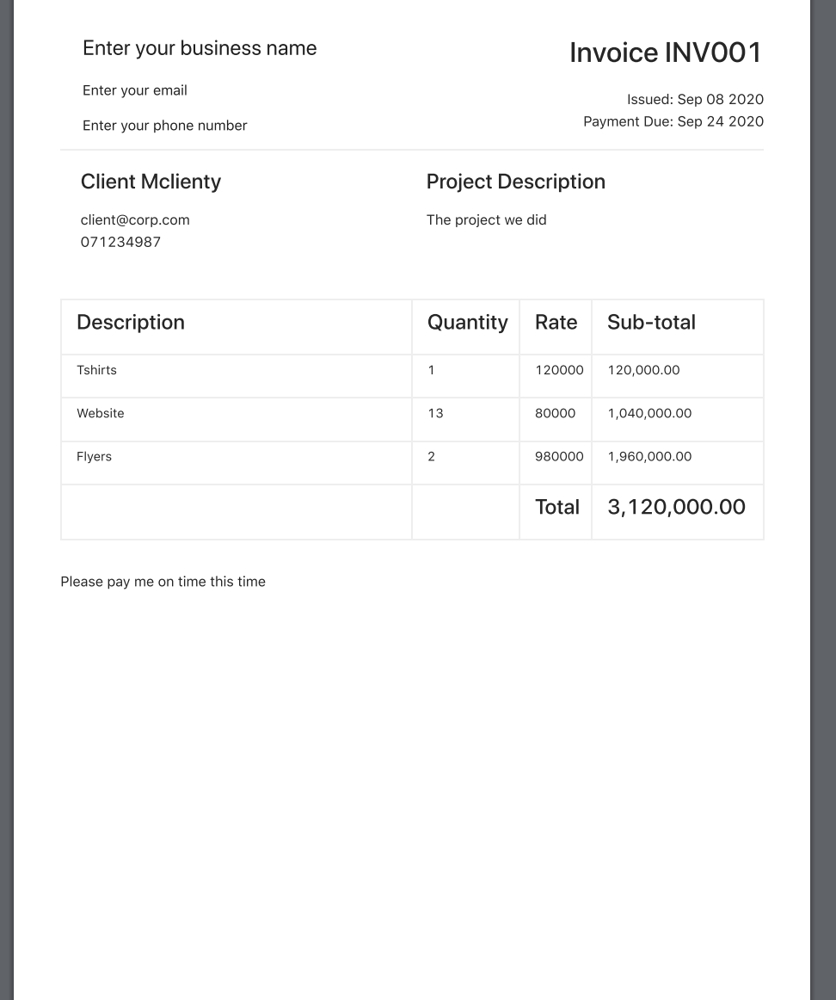

React invoicer
========================

A demo invoicer making app made in reactjs with a nodejs backend

Libraries used
------------

  * Reactjs;
  * [Koajs][1];
  * [ant design component library][2].
  * [pouchdb][3]


Requirements 
------------
  * Nodejs 10 orhigher;
  * A computer

Usage
------------

Run the production script on the root folder
```bash
$ npm run prod
```

Screenshots
------------

### The initial page


### New invoice form


### Invoice list


### View invoice


### Print invoice



Installation
------------

Run npm install on the root folder
```bash
$ npm install
```

Run npm install on the root folder web_app/invoice
```bash
$ npm install
```


Project structure
------------

The backend is just serves the static html file and built react app, most of the business logic is in the frontend. The react app stores data in the user's localstorage with the [Pouchdb][3]. 

Webpack builds the app on the public folder inside the root folder

[1]:https://koajs.com/
[2]:https://ant.design/
[3]:https://pouchdb.com/
